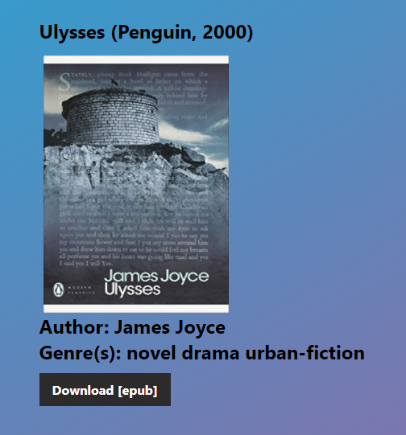

# About: 

A place to search through a database of e-books and download whatever you desire.
I'm working on re-building the frontend of the site with React.js and possibly building a new backend with fastify and swagger. I'm also thinking about switching from postgresQL to a NoSQL Database like MongoDB or Azure Cosmos. 

<a href="books.csv">List of All Books</a> 
<a href="essentials.txt">List of Essential Reads</a> 
<a href="https://nnmax1-ebooks.web.app">Current Site</a>

<h1>Search Settings: </h1>
<li>Title Search: search based on a book's title. </li>
<li>Author Search: search based on a book's author. </li>
<li>Genre Search: search based on a book's genre.  </li>

<h1>Toggle Switches: </h1>
<li>Essential Read? - only displays search results that are categorized as essential reads.  </li>
<li>Recent (2020-Present)？ - only displays books released after the year 2020. </li>
<li>Textbook？ only displays books that are textbooks   </li>

<h1>Formats: </h1>
<li>PDF</li>
<li>EPUB </li>
<li>MOBI</li>
<li>CBR</li>

<h1>Example Search Result: </h1>

            
<h1>Demos </h1>
<h3>Search Title: </h3>

<h3>Search Genre and choose format (epub, pdf, & mobi): </h3>

<h3>Search Author: </h3>

<h3>Feeling Lucky (generates a random book): </h3>

<h3>Search Textbook: </h3>

<h3>Search Recently Released Books (2020 - Present): </h3>

<h3>Search Essential Reads: </h3>
